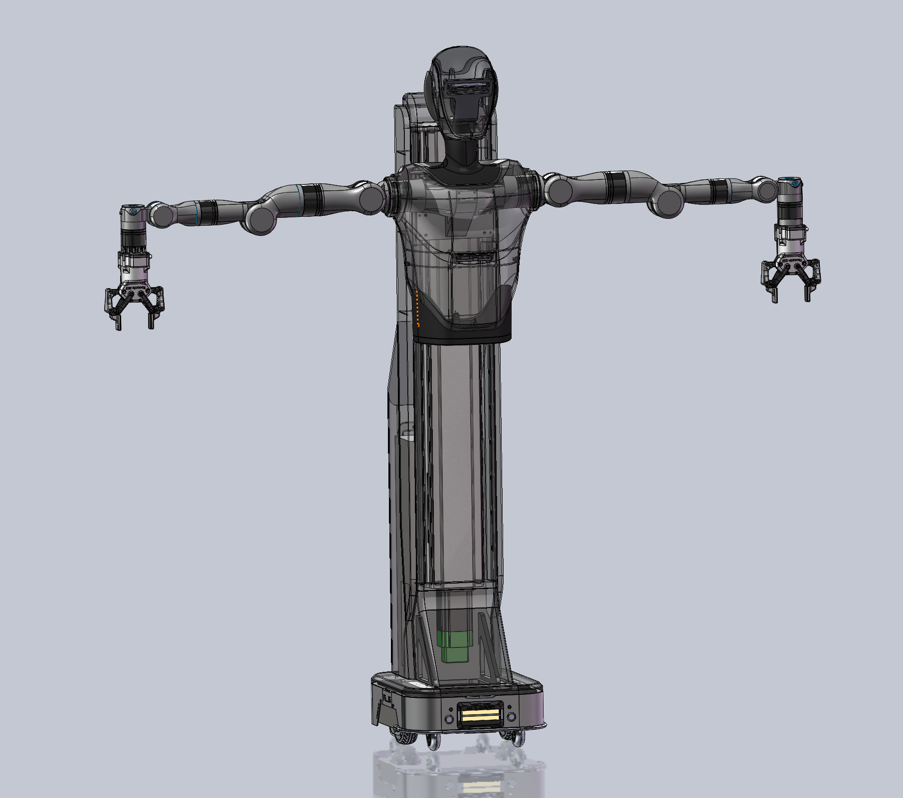

# TR4 复合型人形机器人


|ROS |STATE|
|---|---|
|||

## 概述

TR4 是一个集 **双臂机械臂 + 升降机 + 移动底盘 + 夹爪 + 多相机 + 遥操作** 于一体的复合型机器人平台。  本项目基于 **ROS 2**，提供驱动层、控制层、遥操作层的完整接口，方便二次开发与应用集成。建议使用ubuntu22.04+ROS2 humble 进行开发。


---

## 系统架构

- **Drivers**: 直连硬件 (Arm, Chassis, Elevator, Gripper, Cameras)
- **Controllers**: 高级控制 (滤波、插值、加速度限制、安全保护)
- **Teleop / Apps**: VR/手柄遥操作、任务脚本、外部系统桥接

---

## 快速上⼿攻略（5分钟）
- 安全检查与准备：
清空机器⼈周围 1.5 m 半径的空间；急停按钮可触达(基础版的急停功能需要直接关闭整机电源 按钮来完成，双臂有死特性不会下坠)。打开底盘电源、上电升降机与双臂控制柜；连接开发主机与机器⼈到同⼀⽹段。VR/⼿柄（若使⽤）与主机配对成功。

- 启动顺序：
驱动→控制→遥操作/应⽤

- 驱动层（drivers）：
左右臂  `tr4_arm_driver` 、升降机  `tr4_elevator_driver` 、底盘 `chassis_driver` 、相机 `tr4/usb_cam_right_wrist`、`tr4/ysb_cam_left_wrist`、`tr4/usb_cam_ high`、`tr4/usb_cam_low` 。驱动层负责与硬件直连并发布状态、接收底层控制命令。

- 控制层（controllers）:
臂 `arm_controller` 、夹⽖ `gripper_controller`  、底盘 `chassis_controller`  、升降机控制器`elevator_controller` ，提供安全过滤、出⼊栈、加速度限制等功能。

- 遥操作/上层应⽤:
VR/⼿柄遥操作、任务脚本、桥接到外部系统等。接⼝集中定义在 `interf aces.yaml`

- 最⼩功能验证（示例话题均来⾃接⼝约定）
    1. 让底盘以 `0.1 m/s` 前进并⾃动限加速度：向`controller/chassis/acc_limited_vel_ctrl`  发送   `geometry_msgs/TwistStamped （   linear.x=0.1 ）`。控制器会⾃动做加速度与速度限幅。
    2. 打开左夹⽖：向`controller/left_gripper/dirct_ctrl`发送`moderos_interfaces/GripperCmd{cmd:0, vel:800, eff:30}` ，控制器会按阈值限速限⼒后下发到驱动。
    3. 让右臂回到“复位位”：向`controller/right_arm/simple_reset`发布空消息，等待`contr oller/right_arm/simple_reset_result`返回`true` 。

---

## 节点与话题接口

### 1. 机械臂

#### 1.1 驱动节点 `tr4_arm_driver`
| Node             | Topic                               | Dir  | Msg Type                      | Freq       | Notes |
|------------------|-------------------------------------|------|-------------------------------|------------|------|
| tr4_arm_driver   | `driver/<arm>/pose`                 | Pub  | `geometry_msgs/PoseStamped`   | 100 Hz     | 末端位姿 |
| tr4_arm_driver   | `driver/<arm>/joint_states`         | Pub  | `sensor_msgs/JointState`      | 100 Hz     | 关节状态 |
| tr4_arm_driver   | `driver/<arm>/pose_cmd`             | Sub  | `geometry_msgs/PoseStamped`   | ≤60 Hz     | 下发末端位姿 |
| tr4_arm_driver   | `driver/<arm>/joint_cmd`            | Sub  | `sensor_msgs/JointState`      | ≤60 Hz     | 下发关节角 |
| tr4_arm_driver   | `driver/<arm>/stop_cmd`             | Sub  | `std_msgs/Empty`              | event      | 急停 |
| tr4_arm_driver   | `driver/<arm>/resume_cmd`           | Sub  | `std_msgs/Empty`              | event      | 恢复 |

#### 1.2 控制节点 `arm_controller`
| Node            | Topic                                      | Dir  | Msg Type                    | Freq        | Notes |
|-----------------|--------------------------------------------|------|-----------------------------|-------------|------|
| arm_controller  | `controller/<arm>/linear_interp_pose_ctrl` | Sub  | `geometry_msgs/PoseStamped` | ≤60 Hz      | 线性插值输入 |
| arm_controller  | `controller/<arm>/spline_interp_pose_ctrl` | Sub  | `geometry_msgs/PoseStamped` | ≤60 Hz      | 样条插值输入 |
| arm_controller  | `controller/<arm>/simple_reset`            | Sub  | `std_msgs/Empty`            | event       | 一键复位 |
| arm_controller  | `controller/<arm>/simple_reset_result`     | Pub  | `std_msgs/Bool`             | event       | 复位结果 |
| arm_controller  | `driver/<arm>/pose_cmd` (输出)            | Pub  | `geometry_msgs/PoseStamped` | cfg (~100)  | 转发/插值结果 |

---

### 2. 夹爪
| Node               | Topic                            | Dir  | Msg Type                        | Freq     | Notes |
|--------------------|----------------------------------|------|---------------------------------|----------|------|
| gripper_controller | `controller/<gripper>/dirct_ctrl`| Sub  | `moderos_interfaces/GripperCmd` | event    | 开/关/复位，含 vel/eff |
| tr4_arm_driver     | `driver/<gripper>/cmd`           | Pub  | `moderos_interfaces/GripperCmd` | event    | 驱动下发 RS485 |

---

### 3. 底盘
| Node               | Topic                                   | Dir  | Msg Type                    | Freq    | Notes |
|--------------------|-----------------------------------------|------|-----------------------------|---------|------|
| chassis_controller | `controller/chassis/dirct_vel_ctrl`     | Sub  | `geometry_msgs/TwistStamped`| 5–20 Hz | 直接速度控制 |
| chassis_controller | `controller/chassis/acc_limited_vel_ctrl`| Sub | `geometry_msgs/TwistStamped`| 5–20 Hz | 限加速度控制 |
| chassis_controller | `driver/chassis/cmd_vel_stamp`          | Pub  | `geometry_msgs/TwistStamped`| 5 Hz    | 转发给驱动 |
| tr4_chassis_driver | `driver/chassis/odom`                   | Pub  | `nav_msgs/Odometry`         | 50 Hz   | 里程计 |
| tr4_chassis_driver | `driver/chassis/vehicle_path`           | Pub  | `nav_msgs/Path`             | 50 Hz   | 轨迹 |

---

### 4. 升降机
| Node                | Topic                              | Dir  | Msg Type                   | Freq     | Notes |
|---------------------|------------------------------------|------|----------------------------|----------|------|
| elevator_controller | `controller/elevator/dirct_vel_ctrl`| Sub | `geometry_msgs/TwistStamped`| 5–20 Hz | 直接速度控制 |
| elevator_controller | `controller/elevator/acc_limited_vel_ctrl`| Sub | `geometry_msgs/TwistStamped`| 5–20 Hz | 限加速度控制 |
| tr4_elevator_driver | `driver/elevator/cmd_vel`          | Sub  | `geometry_msgs/TwistStamped`| 5–20 Hz | 速度模式 (50ms 自动置零) |
| tr4_elevator_driver | `driver/elevator/position_cmd`     | Sub  | `sensor_msgs/JointState`    | event    | 高度 (m) |
| tr4_elevator_driver | `driver/elevator/joint_state`      | Pub  | `sensor_msgs/JointState`    | 100 Hz   | 实际高度 |

---

### 5. 相机
| Node              | Topic                   | Dir  | Msg Type                   | Freq   | Notes |
|-------------------|-------------------------|------|----------------------------|--------|------|
| realsense2_camera | `<cam>/color/image_raw` | Pub  | `sensor_msgs/Image`        | 30 Hz  | 彩色图像 |
| realsense2_camera | `<cam>/depth/image_raw` | Pub  | `sensor_msgs/Image`        | 30 Hz  | 深度图像 |
| realsense2_camera | `<cam>/camera_info`     | Pub  | `sensor_msgs/CameraInfo`   | 30 Hz  | 相机内参 |
| realsense2_camera | `<cam>/point_cloud`     | Pub  | `sensor_msgs/PointCloud2`  | 15–30  | 点云 |

---

### 6. 外部桥接 `coinrobot_bridge`
| Node             | Topic                             | Dir  | Msg Type           | Freq    | Notes |
|------------------|-----------------------------------|------|--------------------|---------|------|
| coinrobot_bridge | `/translator_json/left_pose`      | Pub  | `std_msgs/String`  | 100 Hz  | JSON pose |
| coinrobot_bridge | `/translator_json/right_pose`     | Pub  | `std_msgs/String`  | 100 Hz  | JSON pose |
| coinrobot_bridge | `/translator_json/*_joint_state`  | Pub  | `std_msgs/String`  | 100 Hz  | JSON joints |
| coinrobot_bridge | `/translator_json/*_gripper_ctrl_cmd`| Pub| `std_msgs/String` | event   | JSON gripper |

---

## 安全须知

### 1. 全局急停(底盘、升降机、双臂均⽀持停⽌/恢复语义):
- 底盘：`controller/chassis/stop_cmd` 、`resume_cmd` ，停⽌后拒绝执⾏速度命令。
- 升降机：`driver/elevator/stop_cmd` 、`resume_cmd`（驱动）与控制层命令互通语义。
- 机械臂：`driver//stop_cmd`、`resume_cmd`，停后不再执⾏位姿/关节命令。

### 2. 位姿跳变防护
臂控制器校验与当前末端差值>0.2m的位姿命令会被拒绝，避免遥操作抖动或误发布导致的⻜跃。

### 3. 速度/加速度限幅
- 底盘内置速度/加速度双限幅，超出上限将被钳制；⽀持“直接速度控制”和“带加速度限制”的两种接⼝
- 升降机控制器同样提供速度斜坡限制接⼝
- 夹⽖控制器⾃动限⼒（eff）与限速（vel），保护机构与被抓取物体

### 4. 关节限位与奇异位姿检查
臂驱动在下发前检查各轴⻆度上/下限、速度限制与奇异性，不满⾜将拒绝执⾏。

## 关键部位节点说明

### 1. 机械臂 `tr4/arm_driver`,`tr4/arm_controller`

#### 1.1 驱动节点 `tr4_arm_driver`:
- 订阅:
    1. 末端姿态控制`driver/<arm>/pose_cmd` （   `geometry_msgs/PoseStamped` ）与关节⻆`driver/<arm>/joint_cmd` （   `sensor_msgs/JointState` ）。驱动完成 逆解、限位与奇异性分析后执⾏。
    2. 关节控制`driver/<arm>/simple_movej_cmd`
    3. 直线运动控制`driver/<arm>/simple_movel_cmd`
    4. 软件急停`driver/<arm>/stop_cmd`
    5. 软件复位`driver/<arm>/resume_cmd`
- 发布:
    1. 末端姿态`driver/<arm>/pose` , `100hz`, 定频发布该机械臂当前的末端姿态（xyz 空间坐标+四元素xyzw）
    2. 服务式回读：收到`driver/<arm>/get_pose_cmd`或`get_joint_state_cmd`后，分别在`get_pose_result`与`get_joint_state_result`返回⼀次性结果。

#### 1.2 控制节点`arm_controller`：
-  控制接⼝（订阅）：命令过滤与插值，处理流程动作（⼀键复位/待机-⼯作切换/ 挥⼿），并在执⾏“⻓动作”时互斥阻塞其它命令。
    1. 直接控制：`controller/<arm>/dirct_pose_ctrl`与`controller/<arm>/dirct_joint_ctrl`
    2. EMA滤波控制：`controller/<arm>/ema_pose_ctrl` 与`controller/<arm>/ema_joint_ctrl`，α参数可调。
    3. 轨迹插值：线性`controller/<arm>/linear_interp_pose_ctrl`,样条`controller/<arm>/spline_interp_pose_ctrl`; 控制器按`interp_freq`定时发布插值后的`driver/pose_cmd`
    4. 注意：与当前末端姿态相差>0.2m的命令将被拒绝执⾏。

### 2. 夹⽖ `gripper_controller`
- 订阅：`controller/dirct_ctrl` 节点会将 `vel`与`eff` 截断到上限`[max_vel=1000, max_eff=40]`后统⼀发布到驱动层`driver/<gripper>/cmd`
- 指令：`cmd=0` 开， `cmd=1` 关， `cmd=3` 复位；驱动层已经做了必要转换与冗余过滤。

### 3. 升降机 `tr4_elevator_dirver`,`elevator_controller`

#### 3.1 驱动节点
- 模式：位置模式（订阅 `driver/elevator/position_cmd` ）与速度模式（订阅 `driver/elevator/cmd_vel` ）；驱动内部在速度模式下⾃动 50 ms 后置零停⽌，保障安全。
- 单位：位置与速度命令按⽶/⽶每秒传⼊，驱动内部按千分位换算（×1000）与电机通 信；状态回传为⽶。
- 停/复位：`stop_cmd` / `resume_cmd`  控制电机上/下电。

#### 3.2 控制节点
- . 订阅:  `controller/elevator/dirct_vel_ctrl`直接速度控制）与 `acc_limited_vel_ ctrl` （带加速度限制），最终统⼀转换为   `driver/elevator/cmd_vel_stamp` 。

### 4. 移动底盘 `chassis_controller`

#### 4.1 订阅
- 直接速度控制：`controller/chassis/dirct_vel_ctrl` （仅做速度限幅）。
- 带加速度限制：`controller/chassis/acc_limited_vel_ctrl` 

#### 4.2 发布
- 统⼀将速度发布为`driver/chassis/cmd_vel_stamp` （ TwistStamped ，发送频率可设，默认5Hz）

#### 4.3 状态接⼝：
- 订阅`driver/chassis/odom`与`vehicle_path`以便上层做融合或监控

### 5. 相机 `tr4/usb_cam_xxx`
- 统⼀话题命名（图像、压缩图、深度、深度压缩、点云）已在`interfaces.yaml`约定，频率默认 30 Hz；可以直接在此基础上接⼊感知算法。

### 6. 外部系统桥接（JSON）
`coinrobot_bridge` 将 ROS 消息封装为JSON字符串并发布到`/translator_json/* `
- 末端位姿：`/translator_json/left_pose/right_pose`，`message.pose=[x, y,z,qx,qy,qz,qw]` ，含`header.stamp`与` message.timestamp` 。
- 末端跟随命令：`/translator_json/left_pose_follow_cmd  /   right_pose_follow_cmd` 。
- 关节状态：`/translator_json/*_joint_state ，   pos/vel/eff`
- 夹⽖控制：`/translator_json/*_gripper_ctrl_cmd` 。
以上消息都带`frame_id`方便做时间戳对齐。


## 遥操作方案(已做如下适配)
1. VR: `vr_teleop` 将⼿势/⼿柄输⼊映射为插值位姿控制（60 Hz）推给`controller/<arm>/line ar_interp_pose_ctrl` ；并将夹⽖命令与底盘/升降机控制分别发布⾄各⾃控制器话题。还提供
`/record_starts` 、`/record_stop` 触发数据录制。
2. ⼿柄(joy)：`joy_teleop`做“按钮→动作”的映射（如右臂复位、待机/⼯作切换、挥⼿等），并 可下发表层停⽌/恢复命令到底盘/升降机。
3. 建议：遥操作时优先使⽤“插值/限加速度”的通道，能显著降低抖动与超调⻛险（臂：线性/样条； 底盘/升降机：  ` acc_limited_* `）

## 经典操作流程
### 1. 机械臂
- ⼀键复位：发布空消息到 `controller/<arm>/simple_reset` ,等待 `controller/<arm>/si mple_reset_result` 为 `true` 。控制器会在内部清空插值缓存、下发 `MoveJ` 并轮询是 否到位（10 s 超时）。
- ⼯作位 ↔ 待机位:
    1. `move_work2idle` ：仅允许从复位位开始执⾏；控制器会按多段关节序列逐步过渡到待 机位，期间每段都做到位判定。
    2. `move_idle2work`：仅允许从待机位开始执⾏；同样按序列返回复位位

### 2. 夹⽖
发布`GripperCmd`⾄`controller/<gripper>/dirct_ctrl`。cmd ：0 开、1 关、3 复位；   vel （速度）与   eff （⼒度）会被限幅后下发到驱动。

### 3. 升降机
- 速度模式：向`controller/elevator/dirct_vel_ctrl`  或`acc_limited_vel_ctrl`发送`TwistStamped` （   linear.x  为速度），最终由驱动执⾏并在 50 ms 后⾃动置零
- 位置模式：直接向`driver/elevator/position_cmd`发送`JointState.position[0]=目标高度（m）`

### 4. 底盘
推荐向`controller/chassis/acc_limited_vel_ctrl `发送速度指令，控制器会按最⼤速度/加速度限制⽣成  `driver/chassis/cmd_vel_stamp` 。如需⽴即响应的低速微调，可⾛`dirct_vel_ctrl`。

## 参数与调优要点
### 1. 手臂（控制）
- ema_pose_alpha / ema_joint_alpha ：EMA 滤波系数（0~1），越⼩越平滑但延迟越⼤。
- interp_freq / interp_delay / interp_window_size ：插值发布频率、延迟与窗⼝；线 性/样条两通道均受控;use_local_time  决定⽤本地时间还是消息时间戳参与插值。

### 2. 手臂（驱动）
- ⽹络：   arm_ip 、   udp_ip 、   tcp/udp_port
- 运动：   move_speed 、   trajectory_mode 、   follow 、   ik_traversal_mode
- 限位：⾃动加载关节软限位并在求解时做奇异性/速度检查。

### 3. 夹爪
max_vel=1000 、   max_eff=40 （可按夹持对象调整）。

### 4. 底盘
max_linear_vel/acc 、   max_angle_vel/acc  与    cmd_vel_stamp_rate （默 认 5 Hz）

### 5. 升降机
驱动串⼝    serial_port （默认    /dev/ttyUSB0 ）、初始位置    init_pos （mm）、回传频率    joint_state_hz （默认 100 Hz）。

## 数据采集与回读
1.   单次回读：
a.   向    driver/<arm>/get_pose_cmd  /   get_joint_state_cmd  发空消息，驱动将把当前值 发⾄    get_pose_result  /   get_joint_state_result 。适合打标/抓取关键帧。
2.   全程录制：通过    /record_start  与    /record_stop  服务触发（在    vr_teleop  中预置）。
3.   跨系统传输：订阅    /translator_json/*  JSON 话题（带时间戳与    frame_id ），便于⾮ ROS 系统落盘或远程显示

## 故障排查(常⻅报错与处理)

| 现象/日志                                | 可能原因                           | 处理方法 |
|------------------------------------------|------------------------------------|----------|
| **Arm is stopped**                       | 驱动处于 `stop` 状态               | 发布 `driver/<arm>/resume_cmd`；排除外部急停后再试 |
| **Pose command is not safe**             | 位姿跳变 > 0.2 m，被控制器拒绝     | 使用插值/EMA 通道逐步推送，避免大幅跳变 |
| **Failed to move to target joints/pose** | 关节越限 / 速度越限 / 奇异位姿     | 调整姿态；检查 `ik_traversal_mode` 与限位；必要时改用关节直控 |
| **Chassis is stopped, please resume first** | 底盘控制器处于停止状态           | 发布 `controller/chassis/resume_cmd` 后再下发速度 |
| **Elevator is stopped**                  | 升降机处于 `stop` 状态             | 发布 `driver/elevator/resume_cmd` 或控制层对应恢复话题 |
| **夹爪没有动作**                         | 速度/力度超限，被截断为 0          | 调整 `vel/eff`；并确认 `max_vel/max_eff` 参数设置合理 |


## 常用指令
### 1. 启动
```bash
# 启动驱动层
ros2 launch tr4_bringup bringup_drivers.launch.py

# 启动控制层
ros2 launch tr4_bringup bringup_controllers.launch.py

# 启动遥操作 (VR/手柄)
ros2 launch tr4_vr_teleop vr_teleop.launch.py
```

### 2. 线性插值控制左臂末端（60 Hz）
```bash
ros2 topic pub -r 60 controller/left_arm/linear_interp_pose_ctrl/geometry_msgs/PoseStamped "{header: {frame_id: 'left_arm_base_link'}, pose:{position: {x: 0.45, y: 0.10, z: 0.25}, orientation: {x:0, y:0, z:0, w:1}}}"
```
控制器会按`interp_freq` / `interp_delay` 插值并发布到 `driver/left_arm/pose_cmd` 。

### 3. 底盘加速度受限⾏驶
```bash
ros2 topic pub controller/chassis/acc_limited_vel_ctrl/geometry_msgs/TwistStamped "{twist: {linear: {x: 0.2}}}"
```
控制器会限加速度与速度并转发 `driver/chassis/cmd_vel_stamp` 。

### 4. 升降机到 0.6 m（位置模式）
```bash
ros2 topic pub driver/elevator/position_cmd sensor_msgs/JointState "{position:[0.6]}"
```
驱动内部按 ×1000 换算为电机单位。

### 5. 夹⽖开/关
```bash
#开
ros2 topic pub controller/left_gripper/dirct_ctrl/moderos_interfaces/GripperCmd "{cmd: 0, vel: 800, eff: 30}"
```
```bash
#关
ros2 topic pub controller/left_gripper/dirct_ctrl/moderos_interfaces/GripperCmd "{cmd: 1, vel: 800, eff: 30}"
```
控制器会做限速/限⼒再下发驱动

## 其他注意事项

1. 机械臂的 `frame_id`  默认为基座，在做末端控制与 TF对⻬时务必⼀致。
2. 升降机位置/速度均以⽶/⽶每秒对外；不要直接发送电机单位。
3. 初次上电建议先执⾏“夹⽖复位（cmd=3）→ 夹⽖打开（cmd=0）→ 机械臂复位”，再进⾏位姿跟随。
4. 操作时确保四周空旷，无遮挡。