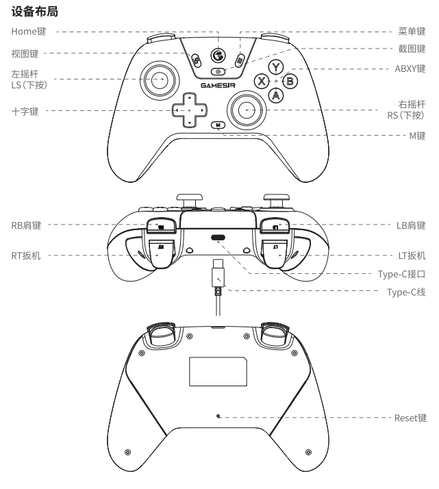
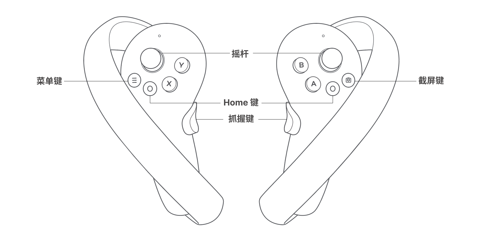

# TR4 Bringup guidence
TR4基础运控的代码与环境已经打包在docker镜像内，详情请见 [tr4_docker](https://github.com/ZhiChengAIR/tr4_docker)

## 启动TR4
TR4 共有2个开关，分别位于背部和底盘后面。背部开关负责双臂，升降，wifi，主控的供电。底盘开关负责底盘单独供电。首先先启动背部和底盘开关（如无需移动可不启动底盘）

## 连接TR4

### 有线连接（推荐）
1. 使用网线连接TR4背部以太网口和上位机pc
2. 设置pc ipv4 method为static， address设置为10.168.2.x (x可以为2~255 任意数)， netmask为255.255.255.0
3. 在terminal内输入
    ```
    ssh tr4@10.168.2.1
    ```
    密码为zcai

### 无线连接
1. 连接wifi tr4 或者 tr4_5g, 密码为tr4_zcai
2. 在terminal内输入
    ```
    ssh tr4@10.168.1.1
    ```
    密码为zcai

## 启动环境和代码
启动环境
```
cd ~/tr4_docker
bash run_moderos_docker.sh
```
待container成功启动后启动代码
```
bash code_run.sh
```

## 遥操
### 手柄遥操
等待手柄成功连接后在tr4环境container内
```
source ~/workspace/install/setup.bash
ros2 launch joy_teleop joy_teleop_use_joystick.launch.py
```
手柄布局：



Y键按下为双臂复位
X键按下为移动双臂到待机姿态
A键按下为急停按钮按钮
B键按下为解除急停按钮

左摇杆LS向前向后为控制底盘向前向后，LS向左向右为控制底盘向左向右旋转
右摇杆RS向前向后为控制升降向上和向下

强制退出joy_teleop节点会自动发出一次全体急停信号，如果其他运控程序未终止，再次启动joy_teleop节点时需要按下B键解除急停才可正常使用
### vr遥操
内置代码使用的vr设备为meta quest2，请用户自行购买
新的vr首次连接需要进入开发者模式，可参考[视频](https://www.bilibili.com/video/BV1tX4y187zz/?spm_id_from=333.999.0.0&vd_source=451077bb19c9440fae9da6977a9dc885)

等待vr成功连接后在tr4环境container内
```
source ~/workspace/install/setup.bash
ros2 launch vr_quest2_pub vr_teleop.launch.py 
```
vr 手柄布局：



vr遥操主要是为数据采集任务服务，所以操作方式为镜像操作，与机器人面对面方便观察任务情况。
左手柄控制机器人右臂，左扳机控制右夹爪； 右手柄控制机器人左臂，右扳机控制左夹爪。

为了安全考虑，只有按住X键，移动右手柄机器人左臂才会移动。同理按下A键移动左手柄机器人右臂才会移动。（支持position和orientation）
按住左扳机为右夹爪轻抓，松开为左扳机为右夹爪松开，按住左抓握键再按住左扳机为右夹爪重抓（抓握物品中，可以通过按下松开抓握键实现力的切换）；同理，左夹爪的控制逻辑为右手斌扳机和抓握键。

LS按下为右臂复位和右夹爪置零，RS按下为左臂复位和左夹爪置零

Y键按下为开始记录数据， B键按下为结束记录指令。（需搭配[coinrobot](https://github.com/ZhiChengAIR/coinrobot_ros2)）


